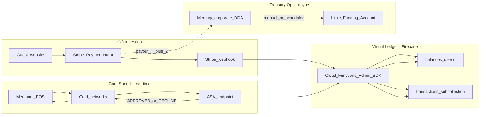
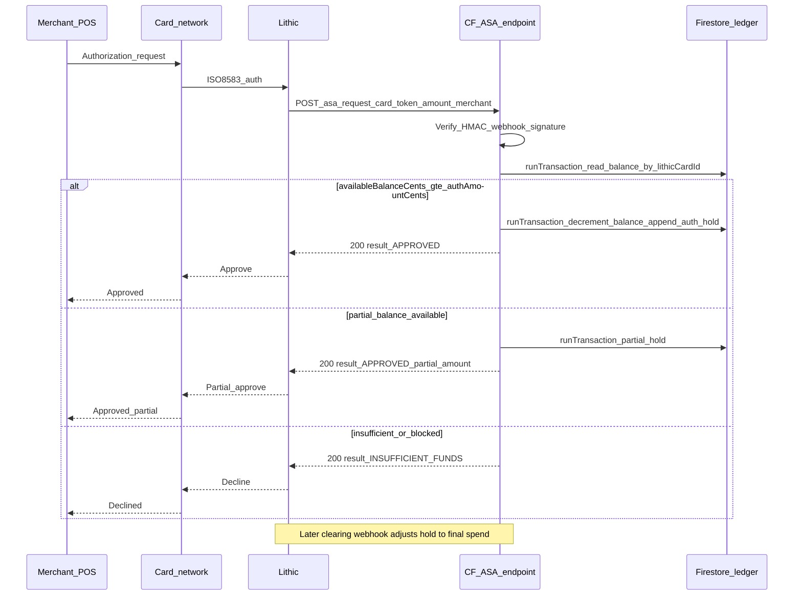

# CreditKid: Lithic + Stripe Payments + Firebase Virtual Ledger

**Standalone implementation plan** — independent of Unit.co / Stripe Treasury / Stripe Issuing paths.

## Product split

| Concern | Provider | CreditKid responsibility |
|---------|----------|--------------------------|
| Guest birthday checkout | `PAYMENTS_PROVIDER=stripe` | Platform PaymentIntents on website; no Connect destination charges in MVP |
| Card issuing + network auth | `BANKING_PROVIDER=lithic` | Lithic virtual cards; ASA endpoint approves/declines in real time |
| Spendable balance | **Firebase virtual ledger** | Integer-cent ledger; Lithic has no retail DDA per child |
| Physical money movement | Mercury (or similar) + Lithic Funding Account | Ops reconciliation; not real-time per swipe |

**MVP cost posture:** Firebase (Spark/Blaze pay-as-you-go), Stripe standard pricing, Lithic program fees per Lithic contract — no Stripe Treasury/Issuing/Connect platform stack.

---

## 1. Architecture and JIT authorization pipeline

### 1.1 High-level system diagram



### 1.2 Gift settlement flow (async money, sync ledger credit)

**Principle:** The child can spend **as soon as the ledger credits**, even before Stripe cash lands in Mercury. Lithic funding is prefunded at the program level; the ledger enforces per-user limits.

| Step | Actor | Action |
|------|-------|--------|
| 1 | Guest | Pays on `piggybank-website` via Stripe Elements |
| 2 | Website | `POST /api/create-payment-intent` creates **platform** PaymentIntent (gift + 3% fee on platform) |
| 3 | Stripe | `payment_intent.succeeded` webhook |
| 4 | Cloud Function | Verify signature; idempotency key = `paymentIntent.id` |
| 5 | Ledger service | **Firestore transaction:** credit `balances/{childOrFamilyId}.availableBalanceCents`; append immutable `transactions` row `type=gift`, `status=posted` |
| 6 | App | Parent/child sees updated balance; event guest marked `paid` |
| 7 | Ops (daily) | Stripe payout → Mercury corporate account |
| 8 | Ops (scheduled) | ACH/wire Mercury → Lithic Funding Account to maintain program float |

**Important:** Steps 7–8 are **reconciliation**, not on the POS critical path. Ledger credit at step 5 is the user-facing truth for spend eligibility.

### 1.3 Lithic JIT / Auth Stream Access (ASA) flow

Lithic **Authorization Stream Access (ASA)** POSTs to your HTTPS endpoint **during** authorization (before settlement). You must return HTTP `200` with `result: "APPROVED"` or a decline reason within **~3 seconds** (6s hard timeout → decline).

Reference: [Lithic ASA docs](https://docs.lithic.com/docs/auth-stream-access-asa)



**ASA handler responsibilities:**

1. Verify `webhook-id`, `webhook-timestamp`, `webhook-signature` (HMAC secret per program).
2. Resolve `card.token` → `userId` via **server-only** `lithicCardIndex/{lithicCardToken}` (see Section 2.1); never read tokens from client-visible documents.
3. Read `availableBalanceCents` (integer) from `balances/{userId}`.
4. **Block high-risk MCCs before balance checks** — mandatory hard decline (no partial approval) for categories that allow offline/incremental authorization and can over-draft the virtual ledger. Minimum blocklist for MVP:
   - `5542` — Automated Fuel Dispensers (offline pre-auth with settlement delta)
   - `5541` — Service Stations (fuel)
   - `6011` — ATM Cash Disbursement
   - `7995` — Gambling / betting
   - `5813` — Drinking places / bars (configurable per parent `blockedMcc`)
   Return `{ "result": "MCC_NOT_ALLOWED" }` or Lithic-equivalent decline reason.
5. Apply parent rules: frozen card, parent `blockedMcc[]`, daily/monthly limits.
6. **Partial approvals (required):** When Lithic requests amount `A` but `availableBalanceCents` is `0 < B < A`, respond with Lithic partial approval semantics — approve **only `B` cents**, hold exactly `B`, and persist `requestedAmountCents: A` on the `auth_hold` row for settlement reconciliation.
7. **Authorization amount modifications (required):** Lithic may send incremental auth, auth replacement, or reversal messages referencing the same `lithicAuthorizationToken`. Handler must be idempotent per message ID and:
   - **Incremental / higher amount:** Re-evaluate available balance; approve delta or decline; update `pendingHoldCents` and append a linked `auth_hold` adjustment row (do not mutate posted rows).
   - **Reversal / lower amount before clear:** Release unused hold back to `availableBalanceCents`; write `auth_release` for the delta.
8. **Firestore `runTransaction`:**
   - Re-read balance inside transaction.
   - If full approve: decrement `availableBalanceCents` by auth amount; write `transactions` doc `type=auth_hold`, `status=pending`, `holdAmountCents`, `requestedAmountCents`, `lithicAuthorizationToken`, `amountCents` negative.
   - If partial approve: same, but `holdAmountCents = min(requested, available)`.
   - If declining: write `transactions` doc `type=auth_decline`, `status=declined` (audit).
9. Return JSON: `{ "result": "APPROVED" }`, partial approval payload per [Lithic ASA partial approval docs](https://docs.lithic.com/docs/auth-stream-access-asa), or decline reason.

**Clearing / void webhooks** (Lithic Events API, separate from ASA):

- `transaction.updated` / clearing events finalize `auth_hold` → `type=spend`, `status=posted`, or release hold on void.
- When **cleared amount ≠ hold amount** (restaurant tip, fuel settlement delta), write `type=adjustment` settlement row (see Section 2.2).
- Use same idempotency pattern (`lithicTransactionToken`).

**Race conditions:** Two concurrent swipes at the same millisecond must not double-spend. Only `runTransaction` inside ASA may mutate `availableBalanceCents`.

### 1.4 Endpoint layout

| Route | Purpose |
|-------|---------|
| `POST /webhooks/stripe` | `payment_intent.succeeded` → ledger credit |
| `POST /webhooks/lithic/events` | Clearing, void, card lifecycle |
| `POST /webhooks/lithic/asa` | **Synchronous** auth decision (dedicated, no heavy middleware) |
| `GET /getProviderConfig` | `{ paymentsProvider: "stripe", bankingProvider: "lithic" }` |

ASA route requirements: minimal middleware, no App Check, no Firebase Auth — only HMAC verification.

**HARD production requirement:** Enforce `minInstances: 1` on the ASA Cloud Function in the production environment. This is not optional. Goal: **p99 ASA handler latency &lt; 300ms** (excluding network RTT to Lithic) so end-to-end responses stay well inside Lithic's ~3s merchant timeout and avoid POS declines from cold starts.

```javascript
// functions/index.js (production ASA export)
exports.asa = functions
  .runWith({ minInstances: 1, timeoutSeconds: 10 })
  .https.onRequest(asaApp);
```

Deploy ASA as a **dedicated function** (separate from the main `api` Express app) to avoid cold-start contention with poster generation and other heavy routes.

---

## 2. Complete Firestore ledger schema

**Rules:** All money fields are **integers in cents**. No floats. All balance mutations via Admin SDK in Cloud Functions only.

### 2.1 Collection: `balances/{userId}`

Document ID = **spend principal** (child UID for child card). **Client-readable** — contains no Lithic tokens or PAN-adjacent identifiers.

```typescript
// balances/{userId}  — safe for thin-client read
{
  userId: string;              // == document id
  parentId: string;            // creator / controlling parent uid
  familyId?: string;
  currency: "usd";
  availableBalanceCents: number; // integer; MAY go negative briefly after settlement adjustment (see 2.2)
  pendingHoldCents: number;    // optional denorm of open auth holds
  status: "active" | "frozen" | "closed";
  spendingLimits?: {
    dailyCents?: number;
    monthlyCents?: number;
    perAuthCents?: number;
  };
  blockedMcc?: string[];       // parent-configured; ASA also enforces platform blocklist
  cardDisplay?: {              // non-sensitive display fields only
    last4: string;
    expMonth: number;
    expYear: number;
    brand: string;
  };
  version: number;             // optimistic concurrency
  createdAt: Timestamp;
  updatedAt: Timestamp;
}
```

**Server-only provider secrets** — never exposed to mobile clients:

```typescript
// balances/{userId}/providerSecrets/lithic  — write: false for all clients
{
  lithicCardId: string;              // Lithic card token
  lithicAccountHolderToken?: string;
  lithicCardPanToken?: string;       // if applicable
  createdAt: Timestamp;
  updatedAt: Timestamp;
}
```

**Server-only ASA lookup index** (Admin SDK only):

```typescript
// lithicCardIndex/{lithicCardToken}  — maps card token → userId for ASA hot path
{
  userId: string;
  parentId: string;
  status: "active" | "frozen" | "closed";
  updatedAt: Timestamp;
}
```

**Indexes required:**

- `lithicCardIndex` document reads by ID (= card token) — O(1), no composite index needed
- `balances` where `parentId ==` (parent dashboard)

### 2.2 Subcollection: `balances/{userId}/transactions/{transactionId}`

Immutable audit trail. **Never update amount** on a `status=posted` row; corrections are **new** rows (`type=adjustment` or `settlement_adjustment`).

```typescript
{
  transactionId: string;
  idempotencyKey: string;
  type:
    | "gift"
    | "auth_hold"
    | "auth_release"
    | "spend"
    | "settlement_adjustment"  // clearing delta vs hold (tips, fuel, partial capture)
    | "refund"
    | "transfer"
    | "adjustment";
  amountCents: number;           // signed: + credit, - debit
  holdAmountCents?: number;        // amount reserved at ASA time
  requestedAmountCents?: number;   // merchant-requested auth amount (may exceed hold for partial approval)
  clearedAmountCents?: number;     // final settled amount from Lithic clearing event
  adjustmentAmountCents?: number;  // clearedAmountCents - holdAmountCents (positive = extra debit e.g. tip)
  status: "pending" | "posted" | "declined" | "voided";
  source: "stripe" | "lithic_asa" | "lithic_event" | "admin";
  externalRefs?: {
    stripePaymentIntentId?: string;
    lithicAuthorizationToken?: string;
    lithicTransactionToken?: string;
    relatedTransactionId?: string; // links adjustment to original auth_hold
    eventId?: string;
    guestId?: string;
  };
  merchantDetails?: {
    name?: string;
    mcc?: string;
    city?: string;
    country?: string;
  };
  balanceAfterCents?: number;    // snapshot after apply; may be negative after settlement_adjustment
  createdAt: Timestamp;
}
```

**Financial clearing / settlement gap (required):**

Authorization (ASA) and settlement (clearing) are separate lifecycle stages. The cleared amount often **differs** from the ASA hold — e.g. restaurant pre-auth $50, final bill $60 with tip; fuel pump pre-auth $100, final capture $45.

The Lithic Events webhook (`transaction.updated` with clearing/settled status) **must**:

1. Load the original `auth_hold` by `lithicAuthorizationToken` / `lithicTransactionToken`.
2. Compute `adjustmentAmountCents = clearedAmountCents - holdAmountCents`.
3. If `adjustmentAmountCents === 0`: mark hold → `spend`, release `pendingHoldCents` bookkeeping only.
4. If `adjustmentAmountCents !== 0`: within a **Firestore `runTransaction`**:
   - Post `type=settlement_adjustment` with `adjustmentAmountCents` (negative if additional debit).
   - Decrement `availableBalanceCents` by the adjustment (may push balance **negative** temporarily).
   - Post final `type=spend` with `clearedAmountCents`.
   - Set `pendingHoldCents` -= `holdAmountCents`.

**Negative balance policy:** Unlike ASA-time checks (which require `availableBalanceCents >= hold`), settlement adjustments **must still apply** even if they force `availableBalanceCents < 0`. This reflects real-world capture-after-auth. Block new ASA approvals while `availableBalanceCents < 0` until gifts/top-ups restore the ledger. Emit ops alert when negative.

### 2.3 Supporting collections

| Collection | Role |
|------------|------|
| `giftSettlements/{paymentIntentId}` | Stripe PI → ledger credit idempotency + ops reconciliation |
| `lithicCards/{uid}` | Display metadata only (last4, exp) — **no tokens** |
| `lithicCardIndex/{lithicCardToken}` | Server-only ASA card → userId lookup |
| `users/{uid}` | Profile — **no balance fields** |
| `events/{eventId}` | `paymentProvider: "stripe"`; guest paid flags |

### 2.4 Ledger write patterns

**Gift credit:**

```javascript
await db.runTransaction(async (tx) => {
  const balRef = db.collection("balances").doc(childUserId);
  const bal = (await tx.get(balRef)).data() || { availableBalanceCents: 0 };
  const idemRef = db.collection("giftSettlements").doc(paymentIntentId);
  if ((await tx.get(idemRef)).exists) return;

  const newBalance = bal.availableBalanceCents + giftAmountCents;
  tx.set(balRef, {
    availableBalanceCents: newBalance,
    version: FieldValue.increment(1),
    updatedAt: FieldValue.serverTimestamp(),
  }, { merge: true });
  tx.set(balRef.collection("transactions").doc(txnId), {
    type: "gift", amountCents: giftAmountCents, status: "posted",
    idempotencyKey: paymentIntentId, source: "stripe", ...
  });
  tx.set(idemRef, { status: "credited", childUserId, giftAmountCents });
});
```

**ASA debit (full or partial):**

```javascript
await db.runTransaction(async (tx) => {
  const snap = await tx.get(balRef);
  const available = snap.data().availableBalanceCents;
  const holdAmount = Math.min(requestedAmountCents, available);
  if (holdAmount <= 0) throw new DeclineError("INSUFFICIENT_FUNDS");

  tx.update(balRef, {
    availableBalanceCents: available - holdAmount,
    pendingHoldCents: FieldValue.increment(holdAmount),
    version: FieldValue.increment(1),
  });
  tx.create(txnRef, {
    type: "auth_hold",
    amountCents: -holdAmount,
    holdAmountCents: holdAmount,
    requestedAmountCents,
    status: "pending",
    idempotencyKey: lithicAuthToken,
    source: "lithic_asa",
    ...
  });
});
// Return Lithic partial approval response when holdAmount < requestedAmountCents
```

**Settlement adjustment (clearing delta):**

```javascript
await db.runTransaction(async (tx) => {
  const hold = await tx.get(holdTxnRef);
  const holdAmount = hold.data().holdAmountCents;
  const adjustment = clearedAmountCents - holdAmount; // e.g. +1000 tip

  const bal = await tx.get(balRef);
  const newBalance = bal.data().availableBalanceCents - adjustment;

  tx.update(balRef, {
    availableBalanceCents: newBalance, // MAY be negative — required
    pendingHoldCents: FieldValue.increment(-holdAmount),
    version: FieldValue.increment(1),
  });
  if (adjustment !== 0) {
    tx.create(adjustRef, {
      type: "settlement_adjustment",
      adjustmentAmountCents: adjustment,
      amountCents: -adjustment,
      clearedAmountCents,
      holdAmountCents: holdAmount,
      status: "posted",
      source: "lithic_event",
      ...
    });
  }
  tx.create(spendRef, { type: "spend", clearedAmountCents, status: "posted", ... });
});
```

---

## 3. Strict Firebase security rules (thin-client)

Create `firestore.rules` at repo root; register in `firebase.json`.

```javascript
rules_version = '2';
service cloud.firestore {
  match /databases/{database}/documents {

    function isSignedIn() {
      return request.auth != null;
    }

    function isOwner(userId) {
      return isSignedIn() && request.auth.uid == userId;
    }

    function isParentOfBalance() {
      return isSignedIn()
        && resource.data.parentId == request.auth.uid;
    }

    match /balances/{userId} {
      // Client may read balance + limits only (no Lithic tokens on this doc)
      allow read: if isOwner(userId) || isParentOfBalance();
      allow create, update, delete: if false;

      // Sensitive fintech tokens — server-only; child/parent cannot read
      match /providerSecrets/{providerId} {
        allow read, write: if false;
      }

      match /transactions/{transactionId} {
        allow read: if isOwner(userId)
          || (isSignedIn()
              && get(/databases/$(database)/documents/balances/$(userId)).data.parentId == request.auth.uid);
        allow create, update, delete: if false;
      }
    }

    // ASA lookup index — must never be client-readable
    match /lithicCardIndex/{lithicCardToken} {
      allow read, write: if false;
    }

    match /giftSettlements/{docId} {
      allow read, write: if false;
    }

    match /lithicCards/{uid} {
      // Display metadata only (last4, exp) — no card tokens
      allow read: if isOwner(uid)
        || (isSignedIn()
            && get(/databases/$(database)/documents/users/$(uid)).data.parentIds.hasAny([request.auth.uid]));
      allow write: if false;
    }

    match /users/{userId} {
      allow read: if isSignedIn();
      allow update: if isOwner(userId)
        && !request.resource.data.diff(resource.data).affectedKeys()
            .hasAny(['availableBalanceCents', 'bankingAccountId', 'virtualCardId']);
      allow create: if isOwner(userId);
    }

    match /events/{eventId} {
      allow read: if true;
      allow write: if false;
    }

    match /ledger/{document=**} {
      allow read, write: if false;
    }
  }
}
```

**Guarantees:**

- Mobile app cannot increment balances or forge gifts.
- Parents cannot write child balances — only read.
- **Lithic card tokens and account-holder tokens are never client-readable** (`providerSecrets`, `lithicCardIndex`).
- User profile updates cannot smuggle balance fields.
- Settlement and idempotency docs are invisible to clients.

---

## 4. Implementation checklist and file structure

### 4.1 Directory map (`functions/`)

```
functions/
├── config/
│   └── providerConfig.js          # BANKING_PROVIDER=lithic, PAYMENTS_PROVIDER=stripe
├── providers/
│   ├── bankingProviderFactory.js
│   ├── lithic/
│   │   ├── lithicClient.js
│   │   ├── lithicBankingProvider.js
│   │   └── lithicAsaHandler.js
│   └── stripe/
│       └── stripePaymentsProvider.js   # platform gifts only — NOT Connect/Treasury
├── services/
│   ├── ledgerService.js
│   ├── paymentsService.js
│   └── giftSettlementService.js
├── controllers/
│   ├── bankingController.js
│   ├── lithicWebhookController.js
│   ├── lithicAsaController.js
│   └── webhookRouter.js
├── repositories/
│   ├── balanceRepository.js
│   └── lithicCardRepository.js
└── index.js
```

### 4.2 Environment variables

```bash
PAYMENTS_PROVIDER=stripe
BANKING_PROVIDER=lithic

STRIPE_SECRET_KEY=sk_test_...
STRIPE_WEBHOOK_SECRET=whsec_...
NEXT_PUBLIC_STRIPE_PUBLISHABLE_KEY=pk_test_...
PLATFORM_FEE_RATE=0.03

LITHIC_API_KEY=...
LITHIC_ENVIRONMENT=sandbox
LITHIC_ASA_HMAC_SECRET=...
LITHIC_PROGRAM_ID=...

MERCURY_ACCOUNT_ID=...
LITHIC_FUNDING_ACCOUNT_ID=...

EXPO_PUBLIC_PAYMENTS_PROVIDER=stripe
EXPO_PUBLIC_BANKING_PROVIDER=lithic
```

### 4.3 Phased checklist

**Phase A — Ledger foundation**

- [ ] `ledgerService.js` + `balanceRepository.js`
- [ ] Deploy `firestore.rules`
- [ ] Stripe webhook → `creditGift` with idempotency
- [ ] `GET /banking/balance` reads `balances/{uid}`

**Phase B — Lithic cards**

- [ ] `lithicClient.js` + `lithicBankingProvider.js`
- [ ] On card create: write tokens to `balances/{childId}/providerSecrets/lithic` + `lithicCardIndex/{token}`; store **display-only** `cardDisplay` on parent `balances` doc
- [ ] `childCardController` uses ledger balance (never reads `providerSecrets` from client)

**Phase C — ASA**

- [ ] Deploy **dedicated ASA Cloud Function** with **`minInstances: 1` (production hard requirement)**
- [ ] `POST /webhooks/lithic/asa` + HMAC verification; target p99 &lt; 300ms handler time
- [ ] `authorizeSpend` with full approve, **partial approve**, and auth-increment/reversal handling
- [ ] Platform MCC blocklist including **5542** (fuel dispensers) — hard decline
- [ ] Sandbox ASA enrollment + concurrent auth tests

**Phase D — Clearing and settlement gap**

- [ ] Lithic `transaction.updated` webhook: `auth_hold` → `spend` or `auth_release` on void
- [ ] **Settlement adjustment:** when `clearedAmountCents !== holdAmountCents`, post `settlement_adjustment` and sync `availableBalanceCents` (allow temporary negative balance)
- [ ] Block new ASA approvals while `availableBalanceCents < 0`; ops alert on negative ledger

**Phase E — App + ops**

- [ ] Provider-neutral UI; `giftSettlements` reconciliation dashboard
- [ ] Mercury → Lithic funding runbook

### 4.4 Risks

- **Prefunding:** Ledger credits can exceed physical cash until ops reconciles.
- **ASA latency:** Enforce `minInstances: 1`; target p99 &lt; 300ms on ASA handler. Lithic hard timeout ~6s; merchant timeouts often ~3s.
- **Settlement gap:** Tips and fuel capture can debit beyond ASA hold; ledger may go negative until next gift.
- **Fuel MCC 5542:** Offline incremental auth can bypass real-time balance unless hard-declined at ASA.
- **No retail DDA:** Balances are platform ledger credits, not bank deposits.
- **Compliance:** Lithic KYC + minor card program must be approved with Lithic.

### 4.5 Success criteria

1. Guest pays $50 → `availableBalanceCents` += 5000 within seconds.
2. Card swipe → ASA approves/declines (including partial approval) based on ledger; MCC 5542 hard-declined.
3. Concurrent swipes cannot double-spend.
4. Clearing webhook posts `settlement_adjustment` when cleared ≠ hold.
5. Client cannot read Lithic tokens or write `/balances` (rules tests pass).
6. Zero Stripe Connect / Treasury / Issuing dependency.
