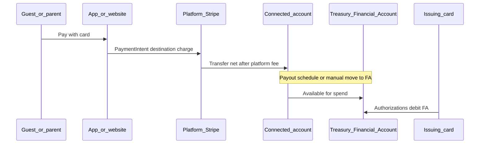

# Plan: Payments → Connect balance → Financial Account → Virtual card

## Goal

Let hosts/parents **receive card payments** (self top-up in the app, **gifts** on the web) so funds land on their **Stripe Connect** account, then become spendable on the **Treasury-backed Issuing** card. Prefer **deferring external bank collection** where Stripe allows (Custom accounts, Treasury path)—see prior research.

## Current state

| Piece | Status |
|--------|--------|
| **Connect account + FA + Issuing** | Implemented (`createCustomConnectAccount`, provisioning, `createVirtualCard`, etc.) |
| **Website gifts** | [`piggybank-website/app/api/create-payment-intent/route.ts`](../piggybank-website/app/api/create-payment-intent/route.ts) creates a **destination charge** (`transfer_data.destination` + `application_fee_amount` 3%) |
| **Mobile `createPaymentIntent`** in [`src/lib/api.ts`](../src/lib/api.ts) | Called `POST /createPaymentIntent` but **route was missing** on Firebase Functions |
| **Balance → FA** | Stripe can route payouts from **payments balance** to **Financial Account** (Dashboard / Balance settings); confirm per account and [Stripe Treasury docs](https://docs.stripe.com/financial-accounts/connect) |

## Architecture (happy path)

## Phases

### Phase A — Ship missing API (done in this PR)

1. Implement **`POST /createPaymentIntent`** on Cloud Functions:
   - Resolve **connected account only from `stripeAccounts/{uid}`** (never trust client `connectedAccountId`).
   - Match website math: **gift amount (cents)** + **3% platform fee** = **total charge**.
   - Create **uncaptured/unconfirmed** PaymentIntent for **client-side** confirmation (`@stripe/stripe-react-native`).
2. Register route in [`functions/routes.js`](../functions/routes.js).
3. Update **PaymentScreen** to work **without** `route.params.accountId` (authenticated user tops up self).
4. Make **`connectedAccountId` optional** in TypeScript client types.

### Phase B — Payment Links (optional product surface)

- Add **`POST /createGiftPaymentLink`** (or Dashboard-created links) with `payment_intent_data[transfer_data][destination]` + `application_fee_amount`, keyed by `eventId` / `creatorId` from Firestore (same logic as website PI).
- Share **hosted URL** in SMS / event page instead of embedding only Elements.

### Phase C — Funds visible on card quickly

1. Confirm **default payout** / **Balance** settings so **payments balance** funds **Financial Account** when appropriate (Stripe Dashboard + [Payouts and top-ups](https://docs.stripe.com/financial-accounts/connect/moving-money/payouts)).
2. If needed, add **server job** or **webhook** to trigger **InboundTransfer** / internal moves per Stripe guidance (only if Dashboard auto-route is insufficient).

### Phase D — Onboarding UX (defer bank)

1. Align **Connect settings** with [Manage payout accounts](https://docs.stripe.com/connect/payouts-bank-accounts): optional **external account collection** during hosted onboarding for Custom accounts.
2. Keep **API** path that creates Connect account **without** bank (already supported in `stripeConnectService`).

## Security & compliance

- **Rate-limit** sensitive payment endpoints (reuse `sensitiveEndpointLimiter` if appropriate).
- **App Check** already applies in live mode via `routes.js`.
- **Do not** log full card data; rely on Stripe.
- **Regulatory**: marketing copy for “wallet / transfer” must match your Connect model; consult Stripe if unsure.

## Review checklist

- [ ] Phase A deployed; mobile self top-up works end-to-end in **test mode**.
- [ ] Website gift flow unchanged and still uses same fee model.
- [ ] Document **minimum charge** (e.g. $0.50) and **fee disclosure** in UI.
- [ ] Confirm Treasury **payout-to-FA** behavior for your account in Dashboard.
